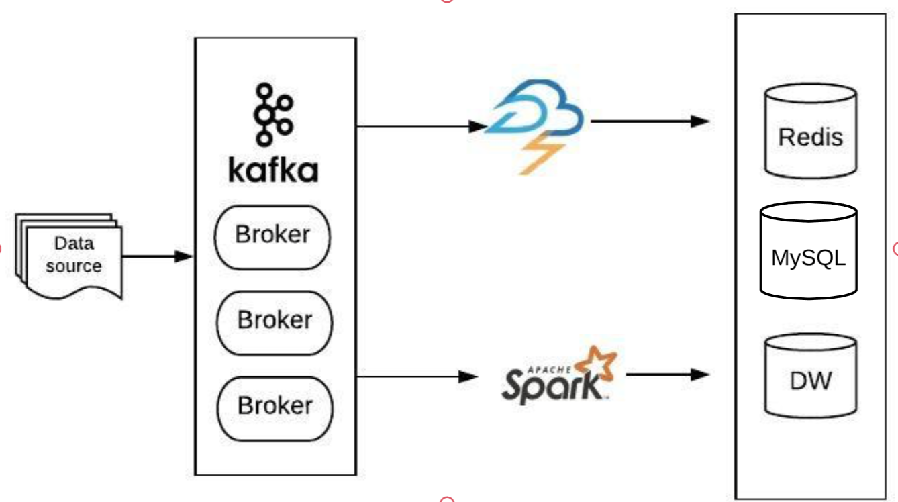

# Architecture
I think what we need here is a lambda-like architecure puls kafka. Below is the overview of  architecture for this requirement.

Each user owns a topic in kafka. Storm will handle the real time data processing inlcuding copy topic to redis cluster. Each user id is a key in redis. It keeps a list which contains the last 100 topics from a user. So we query the redis for quick retivel. Spark will handle the batch processing job. It populates data to RDS and move infrequent access data from RDS to data warehouse. We will also utilize the spark to do the batch processing over RDS and data warehouse.

In terms of reliablity, kafka, storm and apark, they are running with zookeeper to avoid single failure. Redis cluster can be deployed with kubernets to avoid single failure or directly use aws elastic cache service. Data warehouse is any enterprise data warehouse.

In terms of scalability, if a new user enters, we create new topic in kafka and new key in reids.