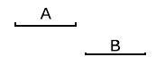

# Algorithm explanation

## Define time range minus

First define the minus(-) operation bwtweem two time range. Let A and B are two time ranges. If A-B there could be 6 situations. The first two are B is outside of A, so A-B will output A.





The third B is overlaping at A's second half, so the output will be the A_begin-B_begin


The forth situation is B is overlaping at A's first half, so the output will be B_begin-A_end.


The fifth situation is B is in A, so the output will be a list which is [A_begin-B_begin, B_end-A_end]


The sixth situation is A in B, so the output is None.


So if we put the result of A-B into a list, from A-B we could get one of the following:

* [A]

* [A_begin-B_begin]
*  [B_begin-A_end]
* [A_begin-B_begin, B_end-A_end]
* []

## Calculate the minus of two sets of time range

Let assume X and Y are two sets, each contains several time ranges. The algorithm for x-y is described as below.

```
Denote y_0 is the first item in Y, y_1 is the second itme in Y ... y_n is the last item in Y.

Let X_0 = X

X_1 = X_0 - y_0 (Use y_0 to minus all items in X_0. Generate a new list)

X_2 = X_1 - y_1

...

X_{n+1} = X_n - y_1

So X_{n+1} is the result of X-Y.
```

pseudo code.

```
result = []
for y in Y:
    for x in X:
        result.extend(x-y)
    X = result
```

## Time complexity

Let n = X.size() and m = Y.size()

The time complexity will be O(nm+m^2)


## How to test the code

Change the `aTimeStr` and `bTimeStr` in the main function to test on different time sets. The program will calculate `aTimeStr - bTimeStr`.

If the hour is one digit, like `9:00`, please make it two digit, for example `09:00`.

            